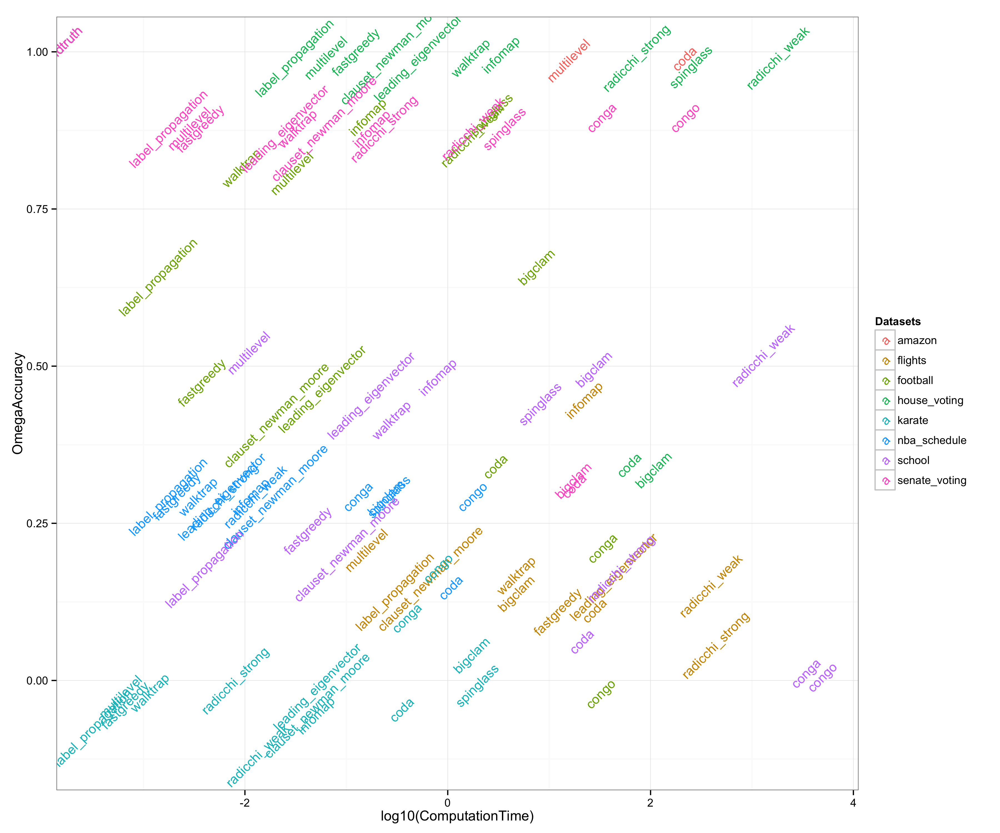
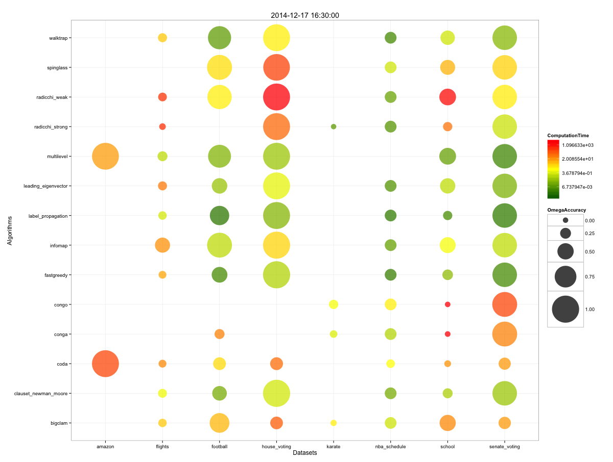
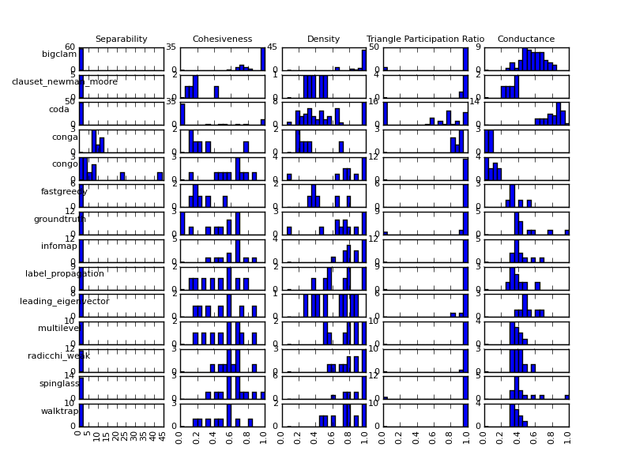
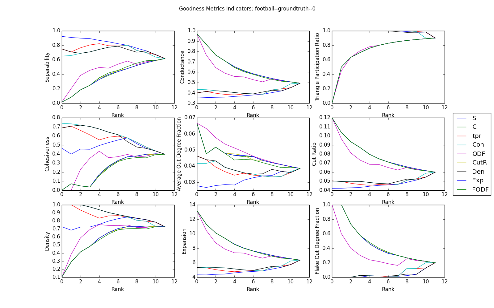

#Experiments

### Ground Truth Similarity Test
- __PATH__: [metrics_clustering.py](metrics_clustering.py)
- __GOAL__: Determine if metrics applied to communities from Ground Truth are similar when grouped with metrics of non Ground Truth communities. The experiemnt leverages kmeans clustering where the features are the metrics, and the observations are a set of features for a given community.  The intuition behind this experiment is that if the ground truth communities fall under the same cluster, then there must exist some combination of metrics that represent the ideal community for this
  particular dataset.
- __RUN__: `python experiments/metrics_clustering.py metrics_dir dataset_name`
- __RESULTS__: The results show the _Groundtruth similarity_ (the largest percentage of ground truth communities in the same cluster), and the Frequency of ground truth communities in the same cluster. For example, you might see the following:
    Groundtruth similarity:  0.5833333333333334 
    Frequency of groundtruth communities as part of centroids [[0 7][1 5]]  

### Time vs Accuracy (two approaches)
#####Approach 1
- __PATH__: [metricsCharts.R](metricsCharts.R)   (Function: plotRunOmega)
- __GOAL__: For a given data set with Ground Truth, measure how the result accuracy changes with certain algorithms, specifically taking into consideration executation time (time complexity). The idea would be to test, for example, time is correlated with accuracy.
- __RUN__:
    - ` metrics <- getMetrics("/path/to/json/metrics", "dataset name (i.e. football)")`
    -  `plotRunOmega(metrics)`
- __RESULTS__: This example shows the log of the calculation time vs. omega score for all the datsets from https://github.com/Lab41/Circulo-Data/releases/tag/2  

#####Approach 2 
- __PATH__: [metricsCharts.R](metricsCharts.R) (Function: plotMetrics)
- __GOAL__: Goal: Compare results computation time and accuracy across datasets
- __RUN__: 
    - `metrics <- getMetrics("/path/to/json/metrics", "dataset name (i.e. football)")`
    - `plotMetrics(metrics)`
- __RESULTS__: This exmple shows the datasets vs algorithms. The size of the bubble represents Omega score and the color represents how long it took to compute that result

### Similar Algorithms
- __PATH__: [cluster_omega_comparison.py](cluster_omega_comparison.py)
- __GOAL__: Determine which algorithms produce similar results by comparing how similar their respective partitions are to eachother.
- __RUN__: `python cluster_omega_comparison.py <path to algo results)>`
- __RESULTS__: Counts of how often two algos produce similar results. For example:

### Histogram metrics across datasets
- __PATH__: [histogram_metrics.py](histograph_metrics.py):
- __GOAL__: This script allows you to compare the result of metrics across algorithms for a single dataset. It creates a histogram for each metric/algorithm pair showing the number of communities for that metric that fall into the specified bin. 
- __RUN__: `python histogram_metrics.py <folder of your metrics json file> <Dataset desired i.e. amazon> [Optional: --metrics Density,Cohesiveness]`
- __RESULTS__: This example shows the distributions of five parameters across datasets for the football data

### Goodness Metrics
- __PATH__: [goodness_indicators.py](goodness_indicators.py)
- __GOAL__: This experiment is based on _Jaewon Yang and Jure Leskovec, http://cs.stanford.edu/people/jure/pubs/comscore-icdm12.pdf, Defining and Evaluating Network Communities based on Ground-truth_. It determines which community metrics are most correlated.
- __RUN__: `python goodness_indicators.py metrics_dir`
- __RESULTS__: An example result for the football ground truth dataset is shown below:

### Combine results into single graphml file
- __PATH__: __create_graphml.py__
- __GOAL__: Create a single graphml file that contains the results off the community detection algorithms as attributes on each vertex. This is useful for visualizing results in Gephi manually or running the java code in this directory to plot them automatically
- __RUN__: python3 create_graphml.py <path to results json files> <Path to graphs, typically circulo/circulo/data/GRAPHS> <output directory for new graphml files> [--least]
-   The --least option causes the "community" stated for a node to be the smallest community (# of nodes) the node is a part of. This is useful for plotting in Gephi
- __RESULTS__: Graphml files that have attritubes for each algorithm that describe which community they were placed in.

#### Plot Community Detection 
- Folder: __gephi_plot__
- Goal: The graphml file created by create_graphml.py makes it easy to view the datset in Gephi and explore the graph. This Java program creates static PDFs of the results from the various aglorithms using Gephi as a layout and plotting engine to visualize the results.
- __COMPILE__: Use Maven to compile the project. mvn compile assembly:single will give you a jar that contains all the dependcies needed to run the executable
- __RUN__: java -jar gephi_plot-0.0.1-SNAPSHOT-jar-with-dependencies.jar <Directory with graphml files or graphml file> <output dir (it won't create a folder for you)>
- __RESULTS__: A set of PDFs are produced using the community detection results to color a visualization of the underlying graph that has been laid out using force-directed layout (Gephi's Force-Atlas 2). This plot is the flights data colored using the Infomap community detection results:

